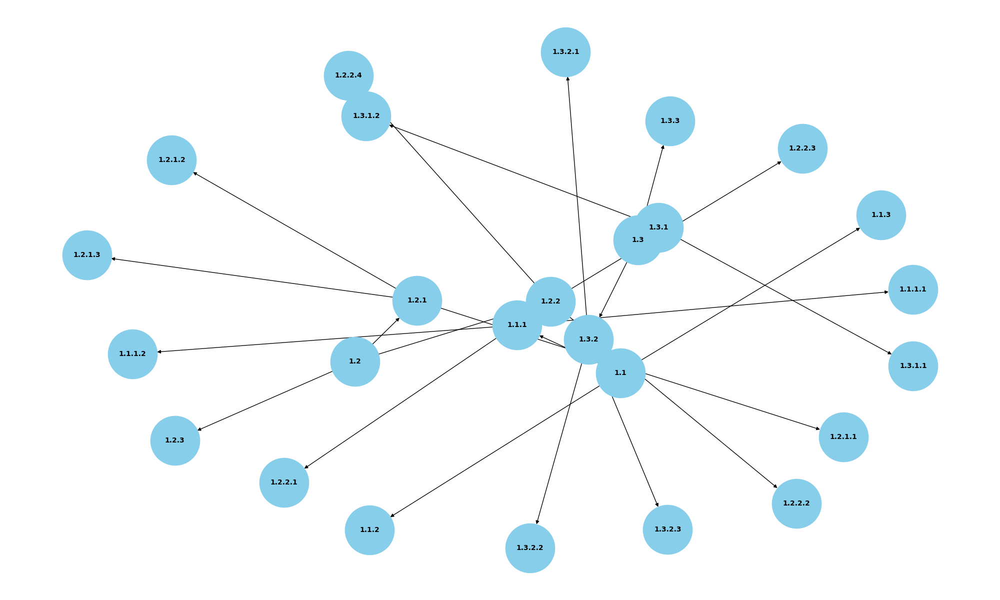

# 📘 Graphical RAG Documentation Authoring Guide

This guide defines the formatting standard for writing technical documents that can be parsed into a **Knowledge Graph** and used in a **Graphical RAG (Retrieval-Augmented Generation)** chatbot system.

## 🖼️ Knowledge Graph Visualization



*The image above shows an example of the knowledge graph structure built from properly formatted documentation.*

## 🔍 Interactive Graph Explorer

This repository includes an interactive graph visualization that allows you to explore the knowledge graph in detail:

- **File:** `data/graph_ui.html`
- **Features:**
  - Zoom in/out to explore different parts of the graph
  - Click on nodes to see their content
  - Drag nodes to rearrange the visualization
  - Hover over nodes to see detailed information

### How to View the Interactive Graph

1. Clone this repository
2. Open `data/graph_ui.html` in any modern web browser
3. Explore the graph by clicking, dragging, and zooming

### How to Generate a New Graph Visualization

The interactive graph is generated using the `graph_visualizer.py` script:

```python
python -m graph_builder.graph_visualizer
```

This will create a new HTML visualization from the current graph data (`data/graph.gpickle`).

---

## 🎯 Purpose

The goal is to structure documentation in a way that allows:
- Easy parsing into graph nodes and edges
- Intelligent search and semantic understanding
- Graph-based context expansion during chatbot inference

---

## 🧱 Document Format Structure

Use numeric hierarchical structure like:

```
1. Main Topic
1.1 Subtopic
1.1.1 Step Description
1.1.1.1 Command or Sub-step
```

Each heading:
- Represents a **graph node**
- Its number implies **depth and relationship**
- Its indented content becomes the **node content**

---

## ✅ Authoring Rules

| Level     | Format         | Example                                  |
|-----------|----------------|------------------------------------------|
| Heading 1 | `1.`           | `1. Generating DDU Image`                |
| Heading 2 | `1.1`          | `1.1 QNX`                                |
| Step      | `1.1.1`        | `1.1.1 Launch the container`             |
| Sub-step  | `1.1.1.1`      | `1.1.1.1 PDK = 6080`                      |
| Commands  | Indented (4 spaces) | `    dazel run ...`                  |

---

## ✍️ Authoring Best Practices

- Keep **titles short** and specific
- Always **indent command/code** blocks with 4 spaces (not tabs)
- Use **plain text** — avoid Markdown symbols like `#`, `-`, `*`
- Add **inline comments** for clarity (e.g., `# PDK = 6080`)
- Do **not skip levels** (you can't have `1.2.3` without `1.2.1`)

---

## 📂 File Naming

Save files in: `data/raw_docs/`

Use filenames like:

```
ddu-linux.txt
flashing-process.txt
qnx-safety.txt
```

Use `.txt` extension only.

---

## ✅ Example (Well-Formatted)

```
1.2 QNX

1.2.1 Container Spinoff
    export NDAS_PARTNER=daimler

1.2.1.3 PDK = 652
    dazel run --config=drive-qnx_6.5.2 //partners/daimler/av/packaging/containers/avos:avos-qnx-daimler

1.2.2 Launch the container
    docker run --rm -dt --privileged --net host ...
```

---

## 🧠 What This Builds in the Graph

Example graph structure:

```
1 ──> 1.2 ──> 1.2.1 ──> 1.2.1.3
              │
              └──> 1.2.2
```

Each `─>` is a **parent → child** relationship. These nodes and their content become part of the searchable knowledge base.

---

## ❌ Common Mistakes

| ❌ Incorrect                     | ✅ Correct                         |
|----------------------------------|-----------------------------------|
| Use of `- Step`                  | Use `1.1.1 Step`                  |
| Tabs for indent                 | 4 spaces only                    |
| Markdown like `## QNX`          | Use `1.1 QNX`                    |
| Long paragraph as a heading     | Break into smaller substeps     |
| Unstructured commands           | Always indent under heading     |

---

🧠 Why Use Graphical RAG Instead of Traditional RAG?

Traditional RAG systems retrieve information from unstructured documents based on vector similarity (semantic embeddings). While effective in some domains, they struggle with technical documentation because of:

- Poor structure in raw text

- Lack of semantic hierarchy

- Difficulty resolving procedural steps or dependencies

## ⚔️ Traditional RAG vs Graphical RAG

| **Feature**                | **Traditional RAG**                         | **Graphical RAG**                                     |
|----------------------------|---------------------------------------------|--------------------------------------------------------|
| **Data Structure**         | Unstructured chunks of text                | Structured, hierarchical nodes                        |
| **Search Type**            | Vector similarity only                     | Semantic + Graph traversal                            |
| **Context Expansion**      | Top-k chunks only                          | Nearby steps, parent sections, children nodes         |
| **Order of Operations**    | Lost in chunk boundaries                   | Preserved via graph path                              |
| **Scalability with Docs**  | Harder to deduplicate or group logic       | Graph allows clustering, deduplication                |
| **Debuggability**          | Opaque - hard to trace sources             | Transparent - every node is traceable                 |
| **Update Process**         | Requires re-embedding whole corpus         | Only new nodes/edges added                           |

---

## ✅ Key Benefits of Graphical RAG

### 1. Context-Aware Retrieval
The graph structure allows retrieving **related steps**, not just similar sentences.

> **Example**:  
If a question hits `1.2.1.3`, we can also expand to `1.2.1`, `1.2`, and `1.2.1.2`.

---

### 2. Preserves Order and Dependencies
Unlike flat chunk-based RAG, Graphical RAG maintains **instruction flow**.

**Example** workflow:
- First: spin off the container  
- Then: launch it  
- Then: generate the image  

✅ This avoids LLM hallucinations or incorrect step orders.

---

### 3. Fine-Grained Search
Each step/command lives in its own graph node, enabling:
- 🎯 High-precision retrieval
- 🔍 Intent filtering (e.g., "build" → only `dazel` commands)

---

### 4. Extensibility
To add more knowledge:
- Just drop new structured `.txt` files into the raw doc folder
- The parser will convert them into nodes & edges
- No need to reprocess the entire graph

---

### 5. Clear Auditability
Every response is traceable:
- Source node ID (like `1.3.2.1`)
- Original file section
- Graph traversal path

This improves **confidence**, **debuggability**, and **trust** in AI-generated answers.

---

## 📜 Why Structured Documentation Is Required

To support graph-based search and reasoning:
- Authors must follow a predictable, hierarchical format

**Benefits of structure:**
- ✅ Enables automatic graph generation from text
- ✅ Reduces ambiguity from unstructured prose
- ✅ Maintains correct context & relationships between steps

**Without structure:**
- ❌ AI may confuse which PDK applies to which step
- ❌ Mix launch instructions with flash steps
- ❌ Retrieve incomplete or irrelevant answers

---

By adopting **Graphical RAG + Structured Authoring**, your system becomes:
- 💡 Smarter in retrieval  
- 🚀 Scalable for future growth  
- ✅ Auditable, interpretable, and production-ready  

## 💬 Questions?

Refer to previous examples in `data/raw_docs/` or contact the Graphical RAG maintainer.

---

Write clean. Think structured. Build the graph 🚀